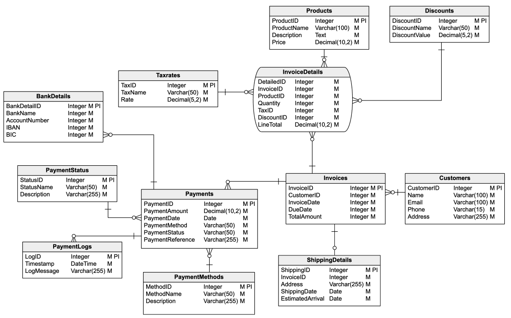
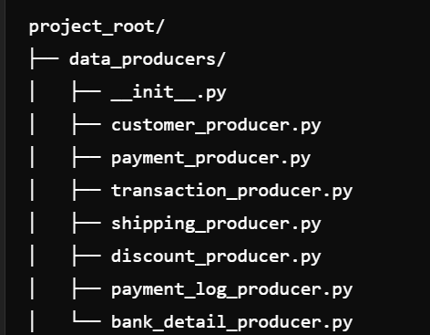
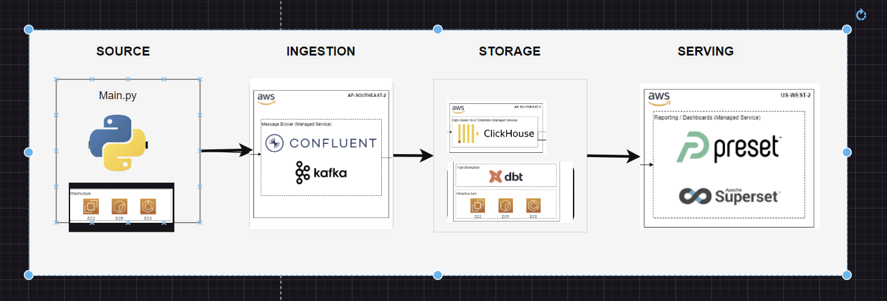
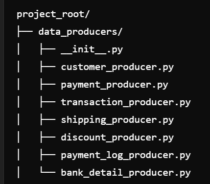
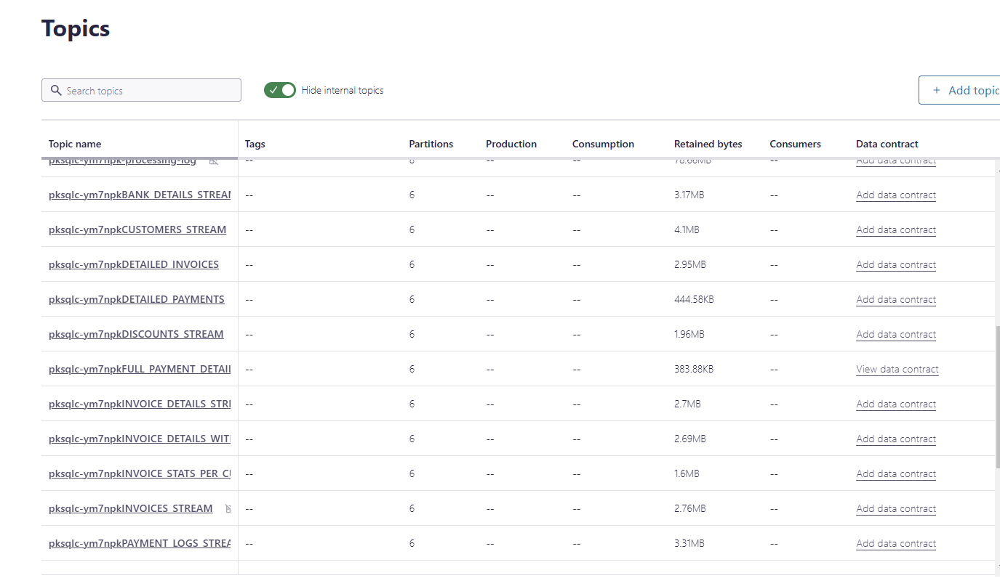
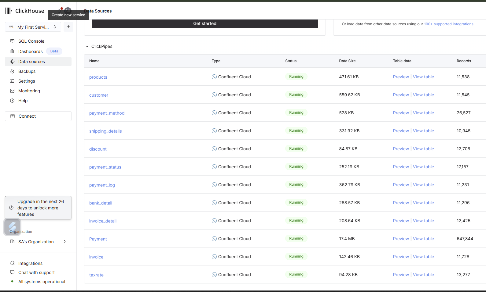

# Project plan
## Billing System Analytics Pipeline

## Objective

The objective of this project is to design and implement a robust billing system leveraging Kafka for real-time data streaming and ClickHouse for high-performance analytical querying. This solution enables efficient tracking, aggregation, and analysis of billing-related transactions and customer payment behaviors at scale.

# ER Diagram
The database model follows the schema described in the Vertabelo Billing System Database Model https://vertabelo.com/blog/billing-system-database-model/. It includes key entities such as customers, payments, transactions, shipping details, and discounts.

## Consumers

### Users Who Would Find the Data Useful:
- Finance Teams:
To track revenue, identify trends, and reconcile payments.
- Operations Teams:
To monitor billing efficiency, address payment issues, and optimize workflows.
- Customer Support Teams:
To access real-time customer payment and billing data for resolving disputes or inquiries.
- Business Analysts and Data Scientists:
For performing deep-dive analysis and generating insights about customer payment behavior and billing patterns.
- Management and Executives:
To monitor financial KPIs and support decision-making with strategic insights.

### Preferred Ways to Access the Data:
- Real-Time Dashboards:

Using tools like Preset connected to ClickHouse for visualizing metrics like transaction counts, revenue, and payment statuses.
SQL Query Interfaces:

- Direct access to ClickHouse via SQL for custom analytical queries and ad-hoc reporting.

## Questions

What questions are you trying to answer with your data? How will your data support your users?

Example:

- Billing and Transactions:

How many payments are processed daily, weekly, and monthly?
What is the average payment amount per customer or transaction?
Which payment methods are most frequently used?
How many transactions fail, and what are the reasons?
What is the revenue generated by each payment method or region?
Customer Insights:

- Which customers have outstanding or delayed payments?
What is the lifetime value (LTV) of each customer?
How frequently do customers make payments?
What are the most common payment delays or disputes by customers?
Regional and Temporal Trends:

- Which countries or regions generate the highest revenue?
What is the payment volume by region over time?
Are there seasonal trends in billing and payments?
What are the busiest days or times for processing payments?
Operational Efficiency:

- How long does it take to process payments from initiation to completion?
What is the success rate of payment transactions?
How many retries are needed for failed transactions?
What are the patterns in payment status changes?

# data source
The data is generated in real time through individual Python producer files that leverage the Faker extension to simulate realistic data for various entities (e.g., customers, payments, transactions, etc.). These producers are integrated and orchestrated through a main Python file, which serves as the central access point for data generation and streaming.

# Workflow:

Producers: Individual Python files generate data for specific entities and stream them into Kafka topics.

Central Orchestration: A main Python file coordinates the producers and streams data into Kafka in real time.

- Problem ER - https://vertabelo.com/blog/billing-system-database-model/
- generator - faker - https://aiven.io/developer/create-your-own-data-stream-for-kafka-with-python-and-faker

## Solution architecture

](image-6.png)

Solution Architecture
The solution implements a data pipeline that streams data from the source (producers) to analytics and reporting dashboards (Preset) using the following components and services:

# Data Flow Steps:
Data Source to Kafka (Data Extraction):

- Individual Python producers generate synthetic data using the Faker library for different domains (e.g., payments, customers).
These producers stream data into Kafka topics in real time.
Kafka to ClickHouse (Data Loading):

- Kafka topics act as an intermediary for streaming data.
Data from Kafka is ingested into ClickHouse using a Kafka-ClickHouse connector for efficient, scalable analytics storage.
ClickHouse to Preset (Data Serving):

- Data stored in ClickHouse is queried and visualized in Preset/Superset for reporting and dashboards.
Preset connects directly to ClickHouse using a SQLAlchemy driver.
Automation and Orchestration:

- Data producers run on a schedule or event-driven triggers (e.g., CRON jobs, AWS Lambda).
Kafka connectors and ClickHouse pipelines are continuously monitored and auto-restarted in case of failures.
Preset provides an automated refresh of dashboards for real-time insights.

## Development and Deployment Process

1. Data Producers

Developed as modular Python scripts for each data entity.

2. Ingestion
Configured to stream data into Kafka topics in confluent cloud.

3. Storage
Confluent cloud to ClickHouse (Data Loading):

Kafka topics act as an intermediary for streaming data.

Data is ingested into ClickHouse using a confluent_cloud connector for efficient and scalable storage.

4. DBT Transformation and Modeling

Data transformations are implemented using dbt to clean, join, and model data.

Key models include:

- fact_transaction
- dim_revenue_adjustments
- dim_product_logistics
- dim_customer_invoices
- dim_payment_details

.png>)

5. . Infrastructure Setup with Terraform

Terraform scripts provision infrastructure in AWS:

EC2 instances for running Kafka, producers
Security groups, IAM roles, and other configurations.

6. Visualization

Dashboards are built in Preset/Superset, providing insights into:

Transaction counts by payment method

Revenue trends by region and time

